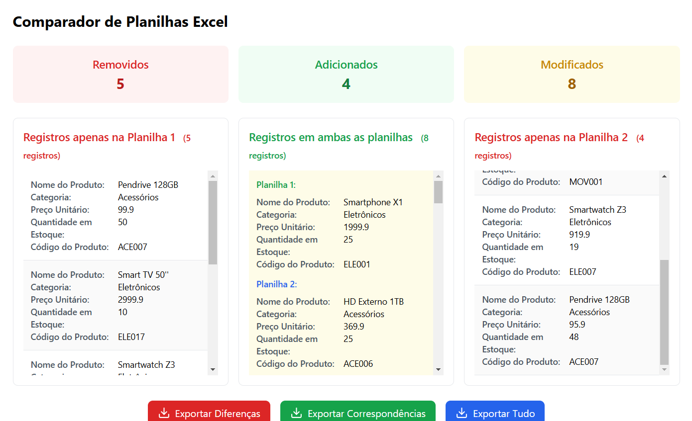

# 📊 Comparador de Planilhas Excel


Uma ferramenta web poderosa e intuitiva para comparar duas planilhas Excel, identificando diferenças, correspondências e alterações entre elas. Ideal para análise de dados, controle de estoque, comparação de preços e muito mais.

## 📑 Índice

- [Funcionalidades](#-funcionalidades)
- [Demonstração](#-demonstração)
- [Requisitos](#-requisitos)
- [Instalação](#-instalação)
- [Como Usar](#-como-usar)
- [Estrutura do Projeto](#-estrutura-do-projeto)
- [Tecnologias](#-tecnologias)
- [Exemplos](#-exemplos)
- [FAQ](#-faq)
- [Contribuindo](#-contribuindo)
- [Licença](#-licença)
- [Contato](#-contato)

## ✨ Funcionalidades

### Comparação de Dados
- ✅ Upload de duas planilhas Excel (.xlsx, .xls)
- ✅ Seleção flexível de colunas para comparação
- ✅ Comparação em tempo real
- ✅ Identificação automática de diferenças

### Opções de Análise
- 🔍 Ignorar maiúsculas/minúsculas
- 🔍 Ignorar espaços em branco
- 🔍 Visualização lado a lado
- 🔍 Destaque de diferenças

### Resultados
- 📊 Registros únicos da Planilha 1
- 📊 Registros únicos da Planilha 2
- 📊 Registros em comum
- 📊 Alterações identificadas

### Exportação
- 📥 Exportar diferenças
- 📥 Exportar correspondências
- 📥 Exportar relatório completo
- 📥 Formato Excel (.xlsx)

## 🎯 Demonstração

### Interface Principal


### Fluxo de Trabalho
1. Upload das planilhas
2. Seleção de colunas
3. Visualização das diferenças
4. Exportação dos resultados

## 💻 Requisitos

### Navegadores Suportados
- Google Chrome (versão 90+)
- Mozilla Firefox (versão 88+)
- Microsoft Edge (versão 90+)
- Safari (versão 14+)

### Requisitos Técnicos
- Conexão com internet (para CDN)
- JavaScript habilitado
- Suporte a HTML5
- Resolução mínima: 1024x768

## 🚀 Instalação

### Método 1: Download Direto
1. Baixe o arquivo `index.html`
2. Abra em um navegador web

### Método 2: Clonando o Repositório
```bash
git clone https://github.com/clerdomy/comparador-planilhas.git
cd comparador-planilhas
```

### Método 3: Servidor Web
1. Copie o arquivo `index.html` para seu servidor
2. Acesse via URL do servidor

## 📖 Como Usar

### 1. Preparação das Planilhas
- Verifique se as planilhas estão no formato .xlsx ou .xls
- Certifique-se que as planilhas têm cabeçalhos
- Recomendado: até 100.000 linhas por planilha

### 2. Upload dos Arquivos
1. Clique em "Selecionar arquivo" para a Planilha 1
2. Clique em "Selecionar arquivo" para a Planilha 2
3. Aguarde o carregamento

### 3. Configuração da Comparação
1. Selecione a coluna de referência da Planilha 1
2. Selecione a coluna de referência da Planilha 2
3. (Opcional) Ajuste as opções de comparação:
   - Comparação em tempo real
   - Ignorar maiúsculas/minúsculas
   - Ignorar espaços em branco

### 4. Análise dos Resultados
- Visualize os registros únicos de cada planilha
- Verifique as correspondências
- Identifique as alterações

### 5. Exportação
1. Escolha o tipo de exportação:
   - Diferenças
   - Correspondências
   - Relatório completo
2. Clique no botão correspondente
3. Salve o arquivo gerado

## 🗂 Estrutura do Projeto

### Arquivos
```
comparador-planilhas/
│
├── index.html          # Arquivo principal
├── README.md          # Documentação
└── LICENSE            # Licença do projeto
```

### Dependências (via CDN)
- Tailwind CSS
- SheetJS (XLSX)

## 🛠 Tecnologias

### Frontend
- HTML5
- JavaScript (ES6+)
- Tailwind CSS

### Bibliotecas
- SheetJS (XLSX) - Manipulação de arquivos Excel
- Tailwind CSS - Framework CSS

### Recursos
- Local Storage para configurações
- File API para manipulação de arquivos
- ES6+ Features

## 📋 Exemplos

### Exemplo 1: Comparação de Produtos

**Planilha1.xlsx:**
```
| Código | Produto  | Preço |
|--------|----------|-------|
| 001    | Produto1 | 10.00 |
| 002    | Produto2 | 20.00 |
```

**Planilha2.xlsx:**
```
| Código | Produto  | Preço |
|--------|----------|-------|
| 001    | Produto1 | 15.00 |
| 003    | Produto3 | 30.00 |
```

**Resultados:**
- Apenas na Planilha 1: Código 002
- Apenas na Planilha 2: Código 003
- Alterações: Código 001 (preço diferente)

### Exemplo 2: Comparação de Estoques

**Planilha1.xlsx:**
```
| SKU    | Quantidade |
|--------|------------|
| ABC123 | 50        |
| DEF456 | 30        |
```

**Planilha2.xlsx:**
```
| SKU    | Quantidade |
|--------|------------|
| ABC123 | 45        |
| GHI789 | 25        |
```

**Resultados:**
- Alterações de estoque: ABC123 (50 → 45)
- Produtos removidos: DEF456
- Produtos novos: GHI789

## ❓ FAQ

### Perguntas Frequentes

**P: Qual o tamanho máximo de arquivo suportado?**
R: O limite depende do navegador e da memória disponível. Recomendamos arquivos de até 50MB.

**P: Os dados são enviados para algum servidor?**
R: Não. Todo o processamento é feito localmente no navegador.

**P: Posso comparar mais de duas planilhas?**
R: Atualmente, o sistema suporta apenas a comparação entre duas planilhas.

**P: Como são tratados os valores nulos ou vazios?**
R: Células vazias são tratadas como valores nulos e são consideradas na comparação.

## 🤝 Contribuindo

### Como Contribuir

1. Faça um Fork do projeto
2. Crie uma Branch para sua Feature
   ```bash
   git checkout -b feature/AmazingFeature
   ```
3. Commit suas mudanças
   ```bash
   git commit -m 'Add some AmazingFeature'
   ```
4. Push para a Branch
   ```bash
   git push origin feature/AmazingFeature
   ```
5. Abra um Pull Request

### Diretrizes
- Mantenha o código limpo e documentado
- Siga os padrões de código existentes
- Teste suas alterações antes de submeter
- Atualize a documentação quando necessário

## 📄 Licença

Este projeto está sob a licença MIT. Veja o arquivo [LICENSE](LICENSE) para mais detalhes.

## 📞 Contato

### Canais de Comunicação
- Email: clerdomyzidor@gmail.com
- GitHub Issues: [Criar Issue](https://github.com/clerdomy/comparador-planilhas/issues)
- LinkedIn: [Seu Nome](https://www.linkedin.com/in/clerdomyzidor/)

### Reportando Problemas
1. Verifique se o problema já não foi reportado
2. Use o template de issues
3. Forneça o máximo de detalhes possível
4. Inclua prints se necessário

## 🔄 Atualizações Futuras

### Planejado para v1.1
- [ ] Suporte a múltiplas colunas para comparação
- [ ] Temas claro/escuro
- [ ] Filtros avançados
- [ ] Visualização em modo tabela

### Planejado para v1.2
- [ ] Suporte a mais formatos de arquivo
- [ ] Comparação de múltiplas planilhas
- [ ] Histórico de comparações
- [ ] Exportação em diferentes formatos

### Planejado para v2.0
- [ ] Interface drag-and-drop
- [ ] Análise estatística
- [ ] Geração de gráficos
- [ ] API para integração


## 🙏 Agradecimentos

- Comunidade Open Source
- Contribuidores do projeto
- Usuários que fornecem feedback
- Bibliotecas utilizadas no projeto

---

Desenvolvido com ❤️ pela comunidade